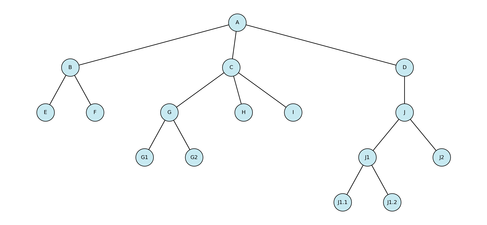
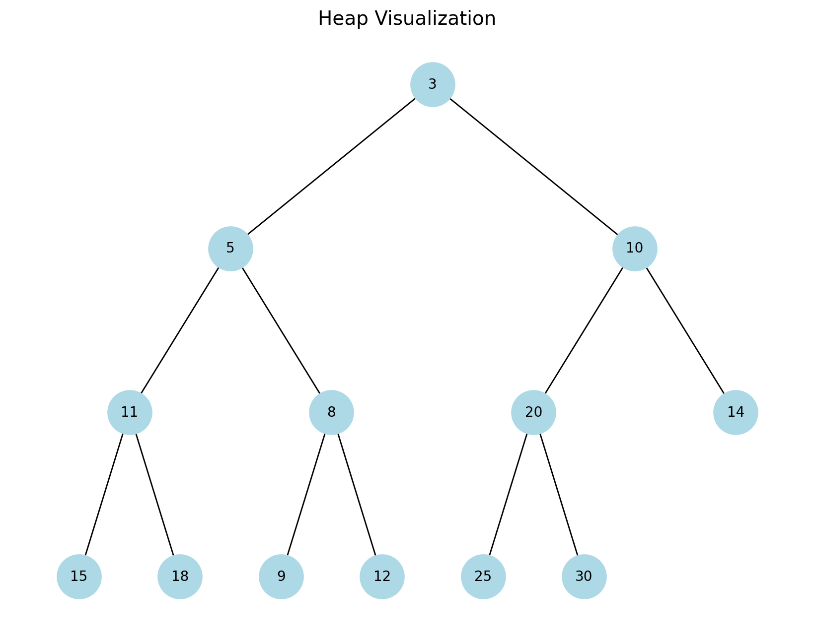

# Data Structure Visualization

# Links
* [University of San Francisco - Data Structure Visualizations](https://www.cs.usfca.edu/~galles/visualization/Algorithms.html)

# Tree

```py
    adj = {
        "A": ["B", "C", "D"],
        "B": ["E", "F"],
        "C": ["G", "H", "I"],
        "D": ["J"],
        "G": ["G1", "G2"],
        "J": ["J1", "J2"],
        "J1": ["J1.1", "J1.2"]
    }
```
# Heap

```py
heap_array = [3, 5, 10, 11, 8, 20, 14, 15, 18, 9, 12, 25, 30]
```
